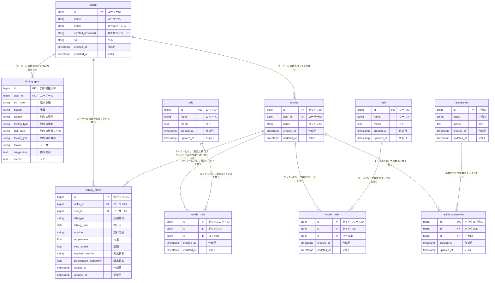

# TackleMaster(タックルマスター)
釣りの楽しさは、釣り具を選ぶところから始まる！

# ■サービス概要
釣りは釣りでも、釣り道具に特化したアプリです。
機能については
- ユーザーの釣り具が登録できます。
- ユーザーの条件に合わせて最適な釣り具の提案させていただきます。

# ■ このサービスへの思い・作りたい理由
釣りにハマるということは、多くの場合、釣り具を選ぶ「沼」にも足を踏み入れることを意味します。

私自身、釣り具を選ぶ過程は楽しいものでしたが、同時にその管理が行き届かず、何を持っているのかわからなくなってしまうことがしばしばありました。
また、釣り具を選ぶためには、魚種や季節、釣り場の条件に合わせた知識が必要とされますが、これが初心者にとっては大きな壁となってしまいます。

このアプリを開発するにあたっての最大の動機は、釣りに出かける際の準備をもっと簡単に、そして楽しみながらできるようにすることです。
釣り具の選択から管理まで、このアプリがあれば、ユーザーは釣り具に関するストレスを大幅に減らすことができます。
初心者でも、どのような条件の下でどの釣り具を選べばいいのか、迷うことなく知ることができるようになります。

このサービスを通じて、釣り具選びの「楽しさ」はそのままに、「わからない」「管理が大変」といったネガティブな部分を解消し、より多くの人が釣りという趣味を楽しめるようになることを目指しています。

一人でも多く、釣りという素晴らしい趣味を全うできるよう、このアプリは釣り具の選択と管理のサポートをします。

# ■ ユーザー層について
- これから釣りを始めたい/興味を持っている方
- 釣り具の管理が行き届いてない方
- 釣り具の情報をまとめたい方

# ■サービスの利用イメージ
ユーザーが釣り道具というものを知るために、「釣り入門」ページを眺めるところからスタートします。
それから、ターゲットとする魚種、行きたい釣り場の種類、使いたい釣法、予算などの条件を入力することで、アプリが釣り具を提案し、その情報をタックルとして登録します。

例えば、初心者が近くの川でバス釣りをしたいけど、何を揃えたらいいかわからない場合、このアプリを使って条件を入力すると、始めるのに必要な釣り竿、リール、ルアーなどを予算内で提案してくれる。

また、すでにいくつか道具を持っている中級者は、新たに挑戦したい釣法や釣り場に合わせた道具の提案を受け、自分のコレクションにないアイテムを見つけることができる。

上級者は、特定の魚種を狙うための高度な釣り具の組み合わせを求めたり、自身の持っている釣り具を管理することができる。

# ■ ユーザーの獲得について
- 各種SNS(X、facebook、instagram、Qiita)での宣伝
- 釣り好きな友人や知人に紹介して使ってもらう

# ■ サービスの差別化ポイント・推しポイント
- **完全カスタマイズのタックル登録**: 類似のサービスでは部分的なタックル登録が可能ですが、本サービスではロッド、リール、その他を含むタックル一式を登録できます。これにより、釣り具の管理と選択を効率化し、差別化を図りたいと考えております。
- **釣り道具に特化したサポート**: 多くの釣りアプリが釣り場情報や天気予報、釣果共有に焦点を当てていますが、本サービスは釣り道具に特化しています。これによりユーザーが釣り道具を選ぶところから楽しめるよう、サポートを提供します。
- **パーソナライズされた釣具提案**: ユーザーの狙う魚種、釣り場知識、予算などを考慮し、最適な釣り具を提案します。これにより、釣り初心者から上級者まで、より多くの人が釣りを楽しめるようになります。

# ■技術スタック
- サーバーサイド：Ruby on Rails
- フロントエンド：リリース後にReact.jsへ徐々に移行する
- cssフレームワーク：TailwindCSS、DaisyUI
- データベース：PostgreSQL
- 開発環境:Docker
- Google認証：Google Identity Platform API
- 最適な釣り具提案機能：Open AI API
- 釣り具の商品表示:楽天API
- インフラ:render
- 画像保存先:AWS S3

# ■「釣り具提案機能」について
ユーザーに向けて、「ターゲット魚種」、「釣り場の種類」、「釣法」、「予算」、「レベル(初心者〜上級者)」を入力してもらい、最適なタックルを一式提案する。
そこから、タックル結果のような感じで、一式表示されるようにする。
ここでOpen AI APIで結果が返されるようにする。
発展させるなら、「釣り具」の入力欄を追加して、タックル一式、ロッド、リール、ライン、ルアーなどが選べるようにして個別に提案できるようにする。

# ■技術構成
## 使用技術
<table>
  <thead>
    <tr>
      <th>カテゴリ</th> <th>技術内容</th>
    </tr>
  </thead>
  <tr>
    <td>バックエンド</td> <td>Ruby3.2.3/Ruby on Rails7.1.3.2</td>
  </tr>
  <tr>
    <td>フロントエンド</td> <td>Tailwindcss/daisyUI</td>
  </tr>
  <tr>
    <td>CSSフレームワーク</td> <td>Ruby on Rails</td>
  </tr>
  <tr>
    <td>Web API</td> <td>OpenAI API(GPT-4o)/Rakuten API/Google OAuth</td>
  </tr>
  <tr>
    <td>データベース</td> <td>PostgreSQL</td>
  </tr>
  <tr>
    <td>環境構築</td> <td>Docker</td>
  </tr>
  <tr>
    <td>インフラ</td> <td>Render/AWS S3</td>
  </tr>
</table>

# ■画面遷移図
https://www.figma.com/file/IyTFoHXk37hss5w02hBsEs/Tackle-Master-%E7%94%BB%E9%9D%A2%E9%81%B7%E7%A7%BB%E5%9B%B3?type=design&node-id=0%3A1&mode=design&t=WoHDNdJyvihqRo84-1

# ■ER図
