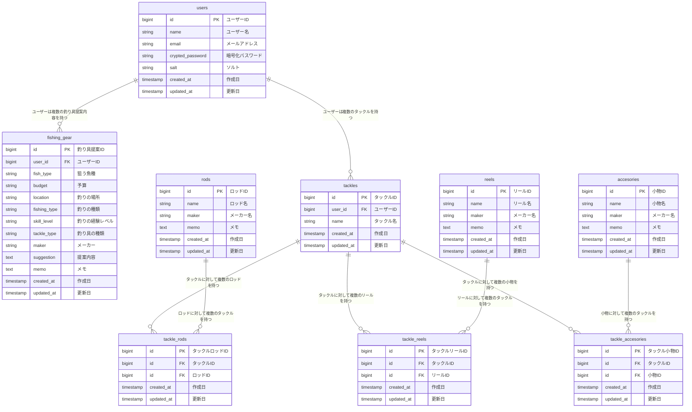

# 🎣 TackleMaster(タックルマスター) 🎣

釣り道具に特化したサービスで釣り道具の管理・登録・検索ができます。

## 🐟 サービスURL 🐟

Googleログインが可能で、すぐに利用することができます。

### [🐠 Tackle Master(タックルマスター) 🐠](https://tacklemaster.net/)

## 🐟 サービス概要 🐟
釣りは釣りでも、釣り道具に特化したアプリです。

機能については
- これから釣りを始めたい方でも釣りや釣り道具について知ることができます。
- ユーザーの釣り具が登録できます。
- ユーザーの条件に合わせて釣り道具を提案させていただきます。

## 🐟 サービスへの思い・作りたい理由 🐟
釣りにハマるということは、多くの場合、釣り具を選ぶ「沼」にも足を踏み入れることを意味します。

私自身、釣り具を選ぶ過程は楽しいものでしたが、同時にその管理が行き届かず、何を持っているのかわからなくなってしまうことがしばしばありました。
また、釣り具を選ぶためには、魚種や季節、釣り場の条件に合わせた知識が必要とされますが、これが初心者にとっては大きな壁となり、私も釣りを始める頃は苦労しました。

このアプリを開発するにあたっての最大の動機は、釣りに出かける際の準備をもっと簡単に、そして楽しみながらできるようにすることです。
釣り具の選択から管理まで、このアプリがあれば、ユーザーは釣り具に関するストレスを大幅に減らすことができます。
初心者でも、どのような条件の下でどの釣り具を選べばいいのか、迷うことなく知ることができるようになります。

このサービスを通じて、釣り具選びの「楽しさ」はそのままに、「わからない」「管理が大変」といったネガティブな部分を解消し、より多くの人が釣りという趣味を楽しめるようになることを目指しています。

一人でも多く、釣りという素晴らしい趣味を全うできるよう、このアプリは釣り具の選択と管理のサポートをします。

## 🐟 メインターゲットユーザー層について 🐟
- これから釣りを始めたい/興味を持っている方
- 釣り具の管理が行き届いてない方

## 🐟 サービスの利用イメージ 🐟
### 🐠 初心者 🐠
ユーザーが釣り道具(タックル)というものを知るために、「釣り入門」ページを眺めるところからスタートします。
それから、ターゲットとする魚種、行きたい釣り場の種類、使いたい釣法、予算などの条件を入力することで、釣り具の提案を受けます。

#### 🐡 タックルとは 🐡

＊＊＊＊＊＊＊＊＊＊＊＊＊＊＊＊＊＊＊＊＊＊＊＊＊＊＊＊＊＊＊＊＊＊＊＊

釣りのための**道具一式**のことを指します。ロッド(釣竿)、リール、ライン(糸)、ルアー(擬似)、仕掛け、エサなどこれら一式指します。狙う魚や釣り方によってタックルは変わります。

タックル例1：狙う魚「アジ、サバ、イワシ」釣り方「サビキ釣り」

ロッド：7~8ftのスピニングロッド、リール：2500〜3000番のスピニングリール、ライン：peライン、ナイロンライン

タックル例2：狙う魚「イナダ、サワラ」釣り方「ルアーフィッシング」

ロッド：9〜10ftのスピニングロッド、リール：4000〜6000番のスピニングリール、ライン：peライン2~3号200m以上、ルアー：40〜60gのメタルジグ

タックル例3：狙う魚「ブラックバス」釣り方「ルアーフィッシング」

ロッド：7〜8ftのベイトロッド、リール：ベイトリール、ライン：ナイロン、peライン、ルアー：ワーム、クランクベイト

＊＊＊＊＊＊＊＊＊＊＊＊＊＊＊＊＊＊＊＊＊＊＊＊＊＊＊＊＊＊＊＊＊＊＊＊

### 🐠 中級者以降 🐠
また、すでにいくつか釣り道具を持っている中級者は、新たに挑戦したい釣法や釣り場に合わせた道具の提案を受け、自分のコレクションにないアイテムを見つけることができます。

上級者は、特定の魚種を狙うための高度な釣り具の組み合わせを求めたり、自身の持っている釣り具を管理することができます。

## 🐟 サービスの差別化ポイント・推しポイント 🐟
- **釣り道具に特化したサポート**: 多くの釣りアプリが釣り場情報や天気予報、釣果共有に焦点を当てていますが、本サービスは釣り道具に特化しています。これによりユーザーが釣り道具を選ぶところから楽しめるよう、サポートを提供します。
- **パーソナライズされた釣具提案**: ユーザーの狙う魚種、釣り場知識、予算などを考慮し、最適な釣り具を提案します。これにより、釣り初心者から上級者まで、より多くの人が釣りを楽しめるようになります。
- **完全カスタマイズのタックル登録**: 類似のサービスでは部分的なタックル登録が可能ですが、本サービスではロッド、リール、その他を含むタックル一式を登録できます。これにより、釣り具の管理と選択を効率化し、差別化を図りたいと考えております。

## 🐟 機能一覧 🐟

- ユーザー登録/ログイン機能/Googleログイン機能
- パスワードリセット機能
- 釣り入門ページ
- 釣り具の提案機能
  - メモのみ編集可能
  - Open AI APIによるプロンプト生成
  - 楽天APIによる商品表示
- タックル登録機能(CRUDアクション)
  - ロッド登録機能(CRUDアクション)
  - リール登録機能(CRUDアクション)
  - 小物機能(CRUDアクション)
- 画像登録/プレビュー機能
- レスポンシブ対応

### 🐠 「釣り具提案機能」について 🐠

ユーザーに「狙う魚」、「予算」、「釣りの場所」、「釣りの種類」、「釣りの経験レベル(初心者〜上級者)」、「釣り具の種類(ロッド、リール、ライン、ルアー、タックル一式)」、「メーカー(各種選択)」を入力してもらい、最適なタックルを一式提案します。Open AI APIにより結果が返されるようにします。

### 🐠 「釣り具登録機能」について 🐠

まずは、「タックル名」と「画像選択(任意)」をしてタックルを作成します。作成したタックルにお好きな分「ロッド」「リール」「小物」を追加してください。これらは、「商品名」、「メーカー」、「画像選択(任意)」、「メモ(任意)」を入力することで追加できます。

## 🐟 機能紹介 🐟

| 釣り入門ページ | スムーススクロール・ページトップへ戻るボタン|
|:---:|:---:|
|||
| 初心者はここから。釣り道具や釣りに関する知識を深めましょう。 | 目次から知りたい情報にアクセスできます。また、右下のボタンからページトップに戻ることができます。|

 

| 釣り具提案機能 |
|:---:|
||
| 狙う魚、予算、釣りの場所、釣りの種類、釣りの経験レベル、釣り具の種類、メーカーを入力してください。あなたに最適な釣り具を提案し、関連する商品も紹介します。いろんな釣り具に出会いましょう！提案は1日3回まで受けることができます。 |
||
| 提案内容は保存されるので、随時見返すことが可能です。 |

 

| 釣り具登録機能 |
|:---:|
|  |
| タックルを作成し、そこにロッド、リール、小物を自由に追加してください。お好みのタックルを作りましょう！画像の登録は任意で、なければデフォルトの画像が設定されます。スマホからの利用をおすすめします。 |
||
| 作成したタックルに、ロッド、リール、小物お好きな分追加してください。こちらも画像登録は任意で、なければデフォルトの画像が設定されます。|
| |
| タックル一覧ページから登録している各タックルに登録しているロッド、リール、小物の数が確認できます。 |

## 🐟 今後の展望 🐟
- 釣り入門ページの内容さらに充実
- 提案内容をSNSでシェアできる機能導入
- 釣り具(タックル)登録機能で、提案された釣り具を保存できるようにする(釣り具名、画像)。
- タックルを登録する際の画像をネット上から取得できるようにする
- メーカーを1から入力するのではなく、オートコンプリート機能を使って入力。
- RSpecテスト実装

## 🐟 技術構成 🐟
### 🐠 使用技術 🐠
| カテゴリ |　使用技術　|
|:-------|:-------|
|バックエンド|Ruby 3.2.3 ・ Ruby on Rails 7.1.3.4|
|フロントエンド|JavaScript|
|CSSフレームワーク|TailwindCSS ・ daisyUI|
|Web API|OpenAI API(GPT-4o) ・ Rakuten API|
|データベース|PostgreSQL|
|環境構築|Docker|
|インフラ|Render ・ AWS S3|
|認証|Sorcery ・ Google OAuth|

## 🐟 画面遷移図 🐟
https://www.figma.com/file/IyTFoHXk37hss5w02hBsEs/Tackle-Master-%E7%94%BB%E9%9D%A2%E9%81%B7%E7%A7%BB%E5%9B%B3?type=design&node-id=0%3A1&mode=design&t=WoHDNdJyvihqRo84-1

## 🐟 ER図 🐟

